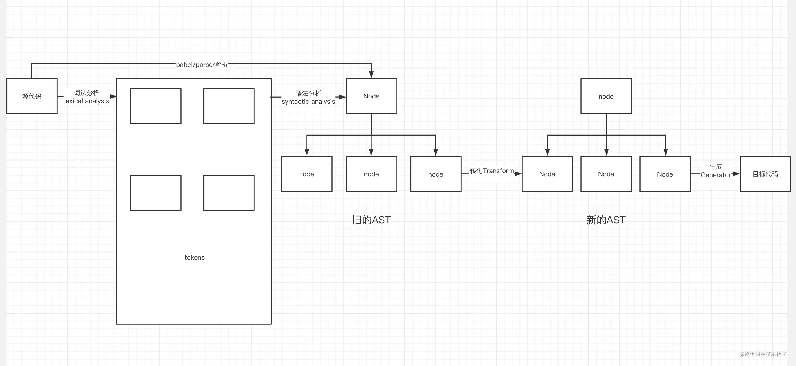

一、 Babel 日常用法

1. 常见 plugin 和 preset

> plugin 和 preset 的区别: 所谓的 preset 就是一些 plugin 组成的合集, 可以将 preset 理解成就是一些 plugin 整合成为的一个包

2. 常见 Preset

- [更多 Preset 查看](https://babeljs.io/docs/en/babel-preset-env)

- `babel-preset-env`

  @babel/preset 是一个智能预设, 它可以将我们高版本 Javascript 代码进行转译根据内置的规则转译成低版本的 Javascript 代码

  preset-env 内部集成了绝大多数的 plugin(state > 3)的转译插件, 它会根据对应参数进行代码转译

  [具体参数配置](https://babeljs.io/docs/en/babel-preset-env#options)

  > @babel/preset-env 不会包含任何地狱 stage3 的 JavaScript 语法提案。 如果需要兼容低版本于 Stage3 阶段的语法则需要额外引入对应的 Plugin 进行兼容

  > 需要额外注意的是 babel-preset-env 仅仅针对语法阶段的转译, 比如转译箭头函数、const/let 语法。针对一些 api 或者 ES6 内置模块的 polyfill, preset-env 是无法进行转译的。

- babel-preset-react

  通常在使用 React 的 jsx 时, 实质上 jsx 最终会编译成为 React.createElement()方法

  babel-preset-react 这个预设起到就是将 jsx 进行转译的作用

- babel-preset-typescript

  对于 typescript 代码, 有两种方式去编译 typescript 代码成为 JavaScript 代码

  - 使用 tsc 命令, 结合 cli 命令参数方式或者 tsconfig 配置未见进行编译 ts 代码
  - 使用 babel, 通过 babel-preset-typescript 代码进行编译 ts 代码

3. 常见 Plugin

- [更多 Plugin 查看](https://babeljs.io/docs/en/plugins-list)

关于常见的 Plugin 其实大多数都集成在 babel-preset-env 中, 当不能支持最新的 js 语法, 此时可以查阅对应的 Babel Plugin List 找到对应的语法插件添加进行 babel 配置

> 一些不常用的 package, 比如@babel/register: 它会改写 require 命令, 为它加上一个钩子。 此后每当使用 require 加载.js、.jsx、.es 和.es6 后缀名文件, 就会先用 Babel 进行转码

4. 前端基建中 Babel 配置详解

关于前端构建工具, 无论使用 webpack 还是 rollup 又或者任何构建工具, 内部都离不开不了 Babel 相关配置

关于 webpack 中日常使用的 babel 相关配置主要涉及以下三个相关插件:

- babel-loader
- babel-core
- babel-preset-env

> webpack 中 loader 的本质就是一个函数, 接受我们的源代码作为入参同时返回新的内容

5. babel-loader

babel-loader 的本质就是一个函数, 我们匹配到对应的 jsx/tsx 的文件交给 babel-loader

```js
/**
 * @param sourceCode 源代码内容
 * @param options babel-loader 相关参数
 * @returns 处理后的代码
 */
function babelLoader(sourceCode, options) {
  //...
  return targetCode;
}
```

babel-loader 参数注入形式

- 支持直接通过 loader 的参数形式注入
- loader 函数内部通过读取.babelrc/babel.config.js/babel.config.json 等文件注入配置

[babel 在各种基建项目的初始化方式](https://babeljs.io/setup)

6. babel-core

babel-loader 仅仅是识别匹配文件和接受对应参数的函数, 那么 babel 在编译代码过程中核心库就是@babel/core

babel-core 是 babel 最核心的一个编译库, 它可以将我们代码进行词法分析 -> 语法分析 -> 语义分析过程从而生成 AST 抽象语法树, 从而对呀这棵树的操作之后再通过编译称为新的代码

> babel-core 其实相当于@babel/parse 和 @babel/generator 这两个包的合体

babel-core 通过 transform 方法将我们的代码进行编译

关于 babel-core 中的编译方法有很多种, 比如直接接受字符串形式的 transform 方法或者接受 js 文件路径的 transformFile 方法进行文件整体编译

[同时支持同步以及异步的方法](https://babeljs.io/docs/en/babel-core)

完善对于的 babel-loader 函数

```js
const core = require('@babel/core');
/**
 * @param sourceCode 源代码内容
 * @param options babel-loader 相关参数
 * @returns 处理后的代码
 */
function babelLoader(sourceCode, options) {
  // 通过transform方法编译传入的源代码
  core.transform(sourceCode);
  return targetCode;
}
```

7. babel-preset-env

babel-loader 本质是一个函数, 他在内部通过 babel/core 这个核心包进行 JavaScript 代码编译

但针对代码的转译需要告诉 babel 以什么样的规则进行转化, 此时 babel-preset-env 在这里充当的就是这个作用: 告诉 babel 需要以什么样的规则进行代码转译

```js
const core = require('@babel/core');
/**
 * @param sourceCode 源代码内容
 * @param options babel-loader 相关参数
 * @returns 处理后的代码
 */
function babelLoader(sourceCode, options) {
  // 通过transform方法编译传入的源代码
  core.transform(sourceCode, {
      presets: ['babel-preset-env'],
      plugin: [...]
  });
  return targetCode
}
```

> 这里 plugin 和 preset 其实是同一个东西, 所以将 plugin 直接放在代码中。 同理一些其他的 preset 或者 plugin 也是发挥这样的作用

8. Babel 相关 polyfill 内容

- polyfill 的概念

  首先先了解三个概念:

  - 最新的 ES 语法, 比如箭头函数, let/const
  - 最新的 ES API: 比如 promise
  - 最新的 ES 实例/静态方法, 比如 String.prototype.include

bebel-preset-env 仅仅之后转化最新的 es 语法, 并不会转化对应的 API 和实例方法, 比如说 ES6 钟的 Array.from 静态方法, babel 是不会转译这个方法的, 如果想在低版本浏览器中识别并且运行 Array.form 方法达到我们的预期就需要额外引入 polyfill 进行在 Array 上添加实现这个方法

- 简单总结

  - 语法层面: preset-env 完全可以胜任语法层面的转化
  - 一些内置方法模块: 需要一系列类似"垫片"的工具进行补充实现这部分内容的低版本代码实现。

- 针对 polyfill 方法的内容, babel 中涉及两个方法来解决

  - @babel/polyfill
  - @babel/runtime
  - @babel/plugin-transform-runtime

9. @babel/polyfill

- 介绍

  通过[babel/polyfill](https://babeljs.io/docs/en/babel-polyfill)通过往全局对象上添加属性以及直接修改内置对象的 prototype 添加方法来实现 polyfill

  比如需要支持 String.prototype.include, 在引入 babel/polyfill 这个包之后, 它会在全局 String 的原型对象添加 include 方法从而支持我们的 JS API

  这种方式本质是往全局对象/内置对象上挂载属性, 这种方式难免会造成全局污染。

- 应用

  在 babel-preset-env 中存在一个 useBuiltIns 参数, 这个参数决定了如何在 preset-env 中使用@babel/polyfill

  ```json
  {
    "presets": [
      [
        "@babel/preset-env",
        {
          "useBuiltIns": false
        }
      ]
    ]
  }
  ```

  - useBuiltIns -- "usage" | "entry" | false

    - false: 当我们使用 preset-env 传入 useBuiltIns 参数时候, 默认为 false。它表示仅仅会转化最新 ES 语法, 并不会转化任何 API 和方法
    - entry: 当传入 entry 时, 需要我们在项目入口文件中手动引入一次 core-js, 他会根据我们配置的浏览器兼容性列表(browserList)然后全量引入不兼容的 polyfill

      > 在 bebel7.4.0 之后, @babel/polyfill 被废弃, 变成另外两个包的集成: "core-js/stable"; "regenerator-runtime/runtime"。可以在[这里](https://babeljs.io/docs/en/babel-polyfill), 但是他们的使用方式是一致的, 只是在入口文件引入的包不同

      > [浏览器兼容性列表配置方式](https://github.com/browserslist/browserslist)

      ```js
      /**
       * 项目入口文件需要额外引入polyfill
       * core-js 2.0 中是使用"@babel/polyfill" core-js3.0 版本中变化成为了上边两个包
       */
      import '@babel/polyfill';

      // babel
      {
          "presets":[
              ["@babel/preset/env", {
                  "useBuiltIns": "entry"
              }]
          ]
      }
      ```

      > 同时需要注意的是, 在使用 useBuiltIns: entry/useage 时, 需要额外指定 core-js 这个参数。 默认为使用 core-js2.0
      > 所谓 core-js 就是垫片的现实, 它会实现一系列内置方法或者 Promise 等 API
      > core-js 2.0 版本跟随 preset-env 一起安装, 不需要单独安装

      - usage

        配置 entry 时, preset-env 会基于我们的浏览器列表进行全量引入 polyfill。 所谓全量引入比如我们代码中仅仅使用了 Array.from 这个方法。但是 polyfill 并不仅仅会引入 Array.from, 同时也会引入 Promise、Array.prototype.include 等其他并未使用到的方法, 这就会造成引入的体积太大

        此时就引入了 useBuiltIns: usage 配置

        当我们配置 useBuiltIns: usage 时, 会根据配置的浏览器兼容, 以及代码中使用到的 API 进行引入 polyfill 按需添加

        当使用 usage 时, 我们不需要额外在项目入口中引入 polyfill 了, 它会根据我们项目使用到的进行按需引入

        ```json
        {
          "presets": [
            [
              "@babel/preset-env",
              {
                "useBuildIns": "usage",
                "core-js": 3
              }
            ]
          ]
        }
        ```

      - 关于 usage 和 entry 存在一个需要注意的本质上的区别

        - 以项目引入 Promise 为例, 当我们配置 useBuildIns: entry 时, 仅仅在入口文件全量引入一次 polyfill。 可以这样理解:

          ```js
          // 当使用entry配置时
          // 一些系列实现polyfill的方法
          global.Promise = promise;

          // 其他文件使用时
          const a = new Promise();
          ```

        - 而当我们使用 useBuildIns: usage, preset-env 只能基于各个模块去分析它们使用的 pilyfill 从而进行引入

          preset-env 会帮助我们智能化的在需要的地方引入, 比如:

          ```js
          // a.js
          import 'core-js/modules/es.promise';
          ```

          ```js
          // b.js
          import 'core-js/modules/es.promise';
          ```

          在 usage 情况下, 如果我们存在很多模块, 那么无疑会多出很多冗余代码(import 语法)

          同样在使用 usage 时因为是模块内部局部引入 polyfill, 所以并不会污染全局变量, 而 entry 是挂载在全局中所以会污染全局变量

        - usageBuildIns 不同参数分别有不同场景的适应度，具体参数使用场景还需要大家结合自己的项目实际情况找到最佳方式。

10. @babel/runtime

@babel/polyfill 是存在污染全局变量的副作用, 在实现 polyfill 时 babel 还提供了另外一种方式去让我们实现这功能, 那就是@babel/runtime

简单来说, @babel/runtime 更像一种按需加载的解决方案, 比如哪里需要使用到 Promise, @babel/runtime 就会给他的文件顶部添加`import promise from 'babel-runtime/core-js/promise'`

同时上边我们讲到对应 preset-env 的 useBuildIns 配置项, 我们的 polyfill 是 preset-env 帮我们智能引入

而 babel-runtime 则会将引入方式交给我们, 需要什么自己引入什么

它的用法很简单, 只能我们去安装`npm install --save @babel/runtime`后, 在需要使用对应的 polyfill 的地方去单独引入就可以了

```js
// a.js 中需要使用Promise, 我们需要手动引入对应的运势polyfill
import Promise from 'babel-runtime/core-js/promise';
const promise = new Promise();
```

总言而之, babel/runtime 可以理解为就是一个运行时"哪里需要引哪里"的工具库

> 针对 babel/runtime 绝大多数情况下我们都会配合@babel/plugin-transform-runtime 进行使用达到智能化 runtime 的 polyfill 引入

11. @babel/plugin-transform-runtime

- babel-runtime 存在的一些问题

babel-runtime 在我们手动引入一些 polyfill 的时候, 它会给我们的代码注入一些类似`_extend()、classCallCheck()`之类的工具函数, 这些工具函数的代码会包含在编译后 deeming 文件中

```js
class Circle {}
// babel-runtime 编译Class需要借助_classCallCheck这个工具函数
function _classCallCheck(instance, Constructor) {
  /***/
}
var Circle = function Circle() {
  _classCallCheck(this, Circle);
};
```

如果我们项目中存在多个文件使用了 class, 那么无疑在每个文件中注入这样一段冗余重复的工具是一种灾难

针对上述提到的两个问题:

- babel-runtime 无法做到智能化分析, 需要我们手动引入
- babel-runtime 编译过程中会重复生成冗余代码

此时就需要用到@babel/plugin-transform-runtime

- @babel/plugin-transform-runtime 的作用

@babel/plugin-transform-runtime 插件的作用就是为了解决上述提到 babel-runtime 存在的问题而提出的插件

- babel-runtime 无法做到智能化分析, 需要我们手动引入

  @babel/plugin-transform-runtime 插件会智能化的分析我们项目中所有使用到需要转译的 js 代码, 从而实现模块化从 babel-runtime 中引入所需的 polyfill 实现

- babel-runtime 编译过程中会重复生成冗余代码

  @babel/plugin-transform-runtime 插件提供了一个 helpers 参数。具体可以[查阅参数](https://babeljs.io/docs/en/babel-plugin-transform-runtime#helpers)

  这个 helpers 参数开启后可以将上边提到编译阶段重复的工具函数, 比如 classCallCheck、 extends 等代码转化称为 require 语句。 此时这些工具函数就不会重复的出现在使用中的模块中了

  ```js
  // @babel/plugin-transform-runtime 会将工具函数转化为require语句进行引入
  // 而非runtime那样直接将工具函数模块注入到模块中
  var _classCallCheck = require('@babel/runtime/helpers/classCallCheck');
  var Circle = function Circle() {
    _classCallCheck(this, Circle);
  };
  ```

- 配置@babel/plugin-transform-runtime

[配置地址](https://babeljs.io/docs/en/babel-plugin-transform-runtime)

```json
// 默认配置
{
  "plugins": [
    [
      "@babel/plugin-transform-runtime",
      {
        "absoluteRuntime": false,
        "corejs": false,
        "helpers": true,
        "regenerator": true,
        "version": "7.0.0-beta.0"
      }
    ]
  ]
}
```

12. 总结 polyfill

在 babel 中实现 polyfill 主要有两种方式

- 通过@babel/polyfill 配合 preset-env 去使用, 这种方式可能会存在污染全局作用域
- 通过@babel/runtime 配合@babel/plugin-transform 去使用, 这种方式并不会污染作用域
- 全局引入会污染全局作用域, 但是相对于局部引入来说, 它会增加很对额外的引入语句, 增加包体积

在 useBuildIns: usage 情况下其实和@babel/plugin-transform-runtime 情况下是类似的作用

建议: 在开发类库时遵守不污染全局为首先使用 @babel/plugin-transform-runtime, 而在业务开发中使用@babel-polyfill

babel-runtime 是为了减少重复代码而生的。 babel 生成的代码，可能会用到一些\_extend()， classCallCheck() 之类的工具函数，默认情况下，这些工具函数的代码会包含在编译后的文件中。如果存在多个文件，那每个文件都有可能含有一份重复的代码。

babel/plugin-transform-runtime 插件能够将这些工具函数的代码转换成 require 语句，指向为对 babel-runtime 的引用，如 require('babel-runtime/helpers/classCallCheck'). 这样， classCallCheck 的代码就不需要在每个文件中都存在了。

二、 Babel 编译原理

> webpack、lint、babel 等很多工具和库的核心都是通过抽象语法树(AST)来实现对代码的处理

1. AST

所谓抽象语法树就是通过 JavaScript Parse 将代码转化为一棵抽象语法树, 这棵树定义了代码的结构, 然后荣归操纵这棵树的增删改查实现对代码的分析, 变更, 优化

针对将代码转化为不同的 AST 你可以在这里 [astexplorer](https://astexplorer.net/) 目前主流任何解析器的 AST 转化。

一些参考网站

- [astexplorer](https://astexplorer.net/): 这是一个在线的代码转译器，他可以按照目前业界主流的方式将任何代码转为 AST。
- [babel-handlebook](): babel 插件开发中文手册文档。
- [the-super-tiny-compiler-cn](https://github.com/starkwang/the-super-tiny-compiler-cn): 一个 github 上的开源小型 listp 风格转化 js 编译器

2. babel 插件开发基础指南

当我们需要开发一款属于自己的 babel 插件时, 通常我们会借助 babel 的一些库去进行代码的 parser 以及 transform ast, generator code, 并不需要我们去手动对代码进行词法/语法分析过程

插件开发通常会涉及这些库:

- @babel/core: babel/core 是 babel 的核心库，核心的 api 都在这里。比如上边我们讲到的 transform，parse 方法。
- @babel/parser: babel 解析器
- @babel/types: 这个模块包含手动构建 AST 和检查 AST 节点类型的方法(比如通过对应的 api 生成对应的节点)
- @babel/traverse: 这个模块用于 AST 的遍历, 它维护了整棵树的状态(需要注意的是 traverse 对于 ast 是一种深度递归)
- @babel/generator: 这个模块用于代码的生成, 通过 AST 生成新的代码返回

3. babel 的工作流程

- Parse(解析阶段): 这个阶段将我们的 js 代码(字符串)进行词法分析生成一系列 tokens, 之后在进行语法分析将 tokens 组合成为一颗语法树(比如 babel-parser 它的作用就是这一步)
- Transform(转化阶段): 这个阶段 babel 通过对于这棵树的遍历, 从而对呀旧的 AST 进行增删改查, 将新的 js 语法节点转化称为浏览器兼容的语法节点(babel/traverse 就是在这一步进行遍历这棵树)
- Generator(生成阶段): 这个阶段 babel 会将新的 AST 转化为同样进行深度遍历从而生成新的代码(@babel/generator)



4. babel 中 AST 的遍历过程

- AST 是所谓的深度优先遍历
- babel 中 AST 节点的遍历是基于一种访问者模式(Visitor), 不同的访问者会执行不同的操作从而得到不同的结果
- visitor 上挂载了以每个节点命名的方法, 当进行 AST 遍历时就好触发匹配的方法名从而执行对应方法进行操作

三、 开发 Babel 插件

1. 目标

```js
// input
const arrowFunc = () => {
  console.log(this);
};

// output
var _this = this;
function arrowFunc() {
  console.log(_this);
}
```

2. babel 原版转换方式

```js
/**
 * babel 插件
 *
 * 主要还是 @babel/core 中的 transform、parse 对 AST 的处理以及babel/types中各种转化规则
 *
 * AST 是一种深度优先遍历, 内部使用访问者(visitor)模式
 *
 * babel主要也是做的AST的转化
 *
 * 1. 词法分析 tokens:  var a = 1 => ['var', 'a', '=', '1']
 * 2. 语法分析: 将 tokens按照固定规则生成AST语法树
 * 3. 语法树转化: 在旧的语法树基础上进行增删改查, 生成新的语法树
 * 4. 生成代码: 根据新的Tree生成新的代码
 *
 *
 * babel核心库(包含core) => AST => code的转化实现
 *
 * babel/core, 其实就可以相当于esprima + Estraverse + EScodegen
 * 它会将原本的sourceCode转化为AST语法树
 * 遍历老的语法树, 会检查传入的插件或则第三个参数中传入的visitor修改对应匹配的节点
 * 生成新的语法树
 * 之后生成新的代码地址
 */
const babel = require('@babel/core');

/**babel/types 工具库, 该模块包含手动构建TS的方法, 并检查AST节点的类型(根据不同节点类型进行转化实现)*/
const babelTypes = require('@babel/types');

/**转化箭头函数的插件*/
const arrowFunc = require('@babel/plugin-transform-arrow-function');

const sourceCode = `const arrowFunc = () => { console.log(this) }`;

/**
 * 使用babel/core, 它的transform方法回将我们的代码转换为AST
 * 同事进入plugins处理成为新的AST, 最终生成对应的代码
 */
const targetCode = babel.transform(sourceCode, {
  plugins: [arrowFunc],
});

console.log(targetCode);
```
